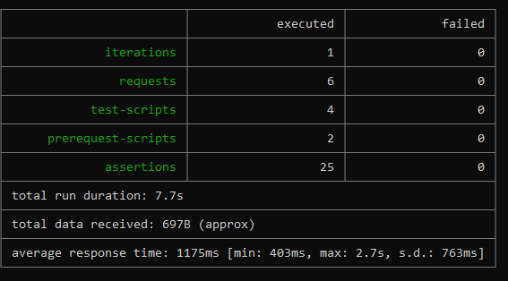
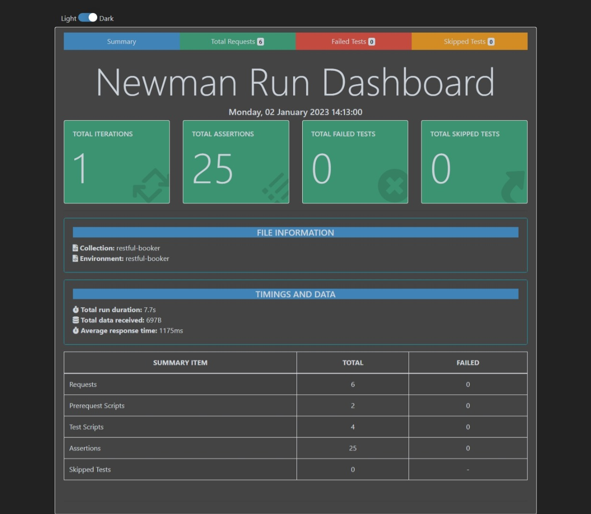

# Content    
- [ Discription](#discription )
- [Summary](#summary) 
- [Newman Report](#newmanreport) 
# Discription 
This document explains how I have done API Testing of restful-booker. I have done Create Token ,Create Book, Get book information,Update Book information, Update Specific book information, Delete Book Tesing by Using Postman.

# Summary 
The Summary of all the tasks done for the restful-booker websites are given below with a table.

# Newman Report
The Report of all the tasks done for the restful-booker websites are given below with a table.

